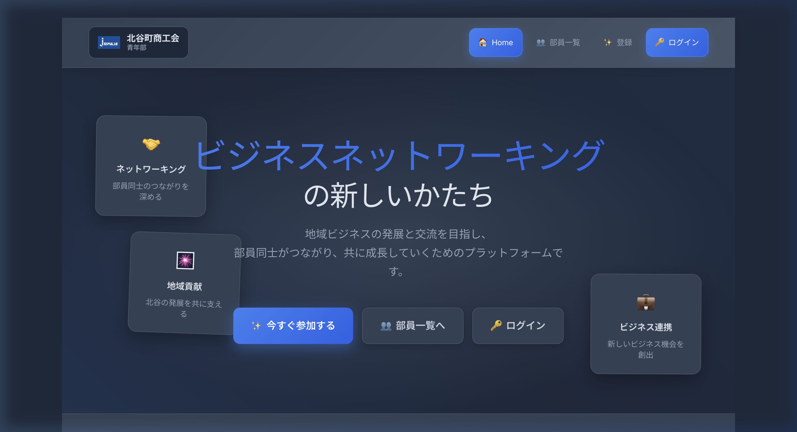

# 🎉 部員情報共有システム：仕組みガイド＋開発環境セットアップ

## ローカル開発サーバーの起動方法

Cursorの左サイドバー下部にある **「NPM スクリプト」** セクションから `dev` の ▶️ ボタンをクリックするだけ。

起動後、ブラウザで **http://localhost:5173/** を開く。

> 「NPM スクリプト」が見当たらない場合は、エクスプローラーの `···`（三点リーダー）メニューから表示をONにしてください。



---

## このシステムの仕組み（やさしく解説）

### 🏗️ 全体像：3つの役割分担

このシステムは大きく分けて **3つの部分** で成り立っています。

| 部分                     | 担当                                     | たとえると…              |
| ------------------------ | ---------------------------------------- | ------------------------ |
| **Vue.js**（画面）       | ユーザーが見て操作する画面を作る         | お店の「店先」や「看板」 |
| **Firebase**（クラウド） | データの保存・ログイン機能を提供         | お店の「倉庫」と「受付」 |
| **Vite**（開発ツール）   | コードを変換してブラウザで動くようにする | お店の「裏方の職人」     |

### 📂 ファイルの見方

```
chatan-sei-nen-bu/
├── src/                    ← ★ 編集するのは主にここ
│   ├── views/              ← 各ページの中身
│   │   ├── HomeView.vue        → トップページ
│   │   ├── MyPageView.vue      → マイページ（プロフィール編集）
│   │   ├── MemberListView.vue  → 部員一覧
│   │   ├── MemberDetailView.vue→ 部員詳細
│   │   ├── AboutView.vue       → ユーザー登録
│   │   └── LoginView.vue       → ログイン
│   ├── App.vue             ← ヘッダー・ナビゲーション
│   └── firebase.js         ← Firebase接続設定
├── index.html              ← HTMLの土台
└── package.json            ← 使用ライブラリ一覧
```

> **💡 ヒント:** `.vue` ファイルは1つのファイルに **HTML（見た目）+ JavaScript（動き）+ CSS（デザイン）** がまとまっています。「このページの見た目を変えたい」と思ったら、対応する `.vue` ファイルを開けばOKです。

---

## 🔄 編集 → 確認の流れ

1. **ファイルを編集**して保存する
2. **ブラウザが自動的に更新**されて変更が反映される（手動リロード不要！）
3. 気に入ったら本番環境にデプロイ

> **⚠️ 重要:** ローカル環境の変更は **あなたのPCの中だけ** で反映されます。本番サイト（`https://chatan-members-site.web.app`）には影響しません。安心してお試しください。

---

## 🚀 本番環境への反映手順

変更を本番サイトに反映したいときだけ、以下のコマンドを実行します：

```bash
# ① ビルド（変換・圧縮）
npx vite build

# ② 一つ上の階層に移動してデプロイ
cd ..
firebase deploy --only hosting
```

> **⚠️ 注意:** 本番環境へのデプロイは全ユーザーに影響します。必ずローカルで動作確認してから実行してください。

---

## ⚠️ 開発サーバーについての注意事項

- NPMスクリプトの ▶️ で起動中の間だけ、ローカルサーバーが動作します
- Cursorを閉じると自動で止まります
- 止まったら再度 ▶️ で起動できます
- **Firebaseのデータ（部員情報）は本番と共有**されています。ローカルでもログインや部員一覧は本番データを参照します

---

## 📌 よく使う操作まとめ

| やりたいこと         | 方法                                                          |
| -------------------- | ------------------------------------------------------------- |
| 開発サーバー起動     | NPMスクリプト → `dev` → ▶️                                    |
| 開発サーバー停止     | ターミナルで `Ctrl + C`                                       |
| ターミナルを開く     | `Ctrl + バッククォート（`）`                                  |
| 変更をブラウザで確認 | ファイル保存で自動反映                                        |
| 本番にデプロイ       | `npx vite build` → `cd ..` → `firebase deploy --only hosting` |
